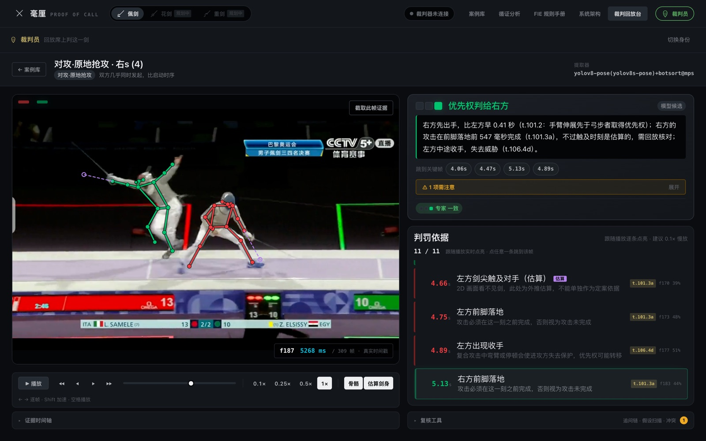
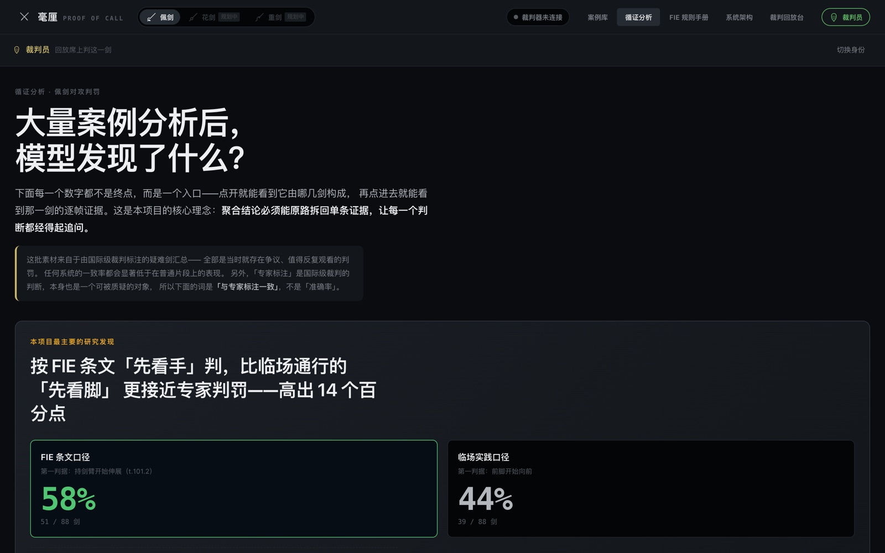
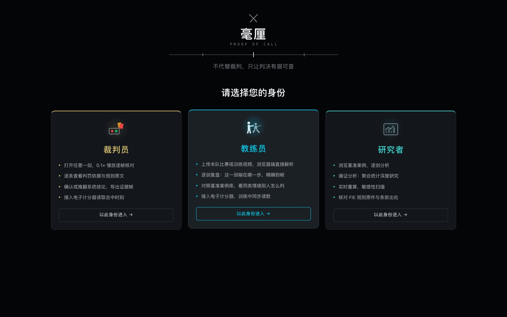

<div align="center">

# 毫厘 · PROOF OF CALL

### 不代替裁判，只让判决有据可查

佩剑对攻判罚的证据链系统 —— 不产出最终答案，产出一条可以一路追问到帧号和规则原文的证据链

**在线体验**　[▶ 国内访问 · 联通](http://218.11.5.249:10341)　[▶ 国内访问 · 移动](http://111.62.156.213:10338)　[▶ 海外访问](https://proof-of-call.vercel.app)

[核心创新点](#四核心创新点) · [研究发现](#研究发现) · [快速开始](#六快速开始)

<sub>She Nicest 2026 北京夏季烈变千人黑客松 · 软件应用赛道「滴水穿石」<br>命题：沙利文 PROOF OF INSIGHT — 让行业判断经得起追问</sub>

</div>



<div align="center"><sub>画面慢放到 0.1 倍速，右侧判罚依据跟着播放逐条点亮。每条都写明：谁、在第几秒、做了什么、依据 FIE 哪一条规则。</sub></div>

---

## 它做什么

- **把一次判罚拆成可追问的证据链**　每条依据带帧号、毫秒时间戳与 FIE 条款号，点一下跳到那一帧
- **两套判据口径并行**　FIE 条文（先看手臂伸展）与临场实践（先看前脚启动）各跑一遍，分歧时如实报冲突
- **证据不足就拒绝下结论**
- **假设全部外露且可实时扰动**
- **人的结论覆盖模型**　任意节点可确认或推翻，推翻需写理由并记入证据链

<a id="研究发现"></a>

## 研究发现

在 131 段巴黎 2024 奥运会佩剑争议判罚上实测：

| | |
|---|---|
| 按 **FIE 条文口径**判，与国际级裁判标注一致 | **58.0%** |
| 按**国内临场实践口径**判 | **44.3%** |
| **两者相差** | **13.7 个百分点** |
| 两套口径给出不同答案的比例 | **67.2%** |

这个分歧本身，就是判罚说不清的地方。



---

## 三种身份，三种界面

| 身份 | 进来落在 | 上传视频 | 接裁判器 |
|---|---|---|---|
| **裁判员** | 直接进裁判回放台，一剑已打开 | ✗ | ✓ |
| **教练员** | 案例库 + 上传面板 | ✓ | ✓ |
| **研究者** | 案例库，纯观看分析 | ✗ | ✗ |



---

## 一路追问下去

任意一条依据都能展开：用什么公式、取值多少、信源是哪一条、依赖哪些假设。
追问到底只有两种终点——**某一帧上的一个测量值，或规则原文里的一句话**。


---

## 目录

| | |
|---|---|
| [一、为什么做这个](#一为什么做这个) | 项目背景与竞品缺口 |
| [二、这与沙利文命题的关系](#二这与沙利文命题的关系) | 命题逐条对照 |
| [三、目标用户](#三目标用户) | 四类用户与权限模型 |
| [四、核心创新点](#四核心创新点) | 七项，含两处击剑专项工程修正 |
| [五、技术栈](#五技术栈) | 离线管线与前端 |
| [六、快速开始](#六快速开始) | 本地运行与数据重建 |
| [七、数据集](#七数据集) | 131 段素材来源与标注 |
| [八、已知边界](#八已知边界) | 做不到什么 |
| [九、开发过程](#九开发过程) | 关键节点 |
| [十、团队分工](#十团队分工) | 个人参赛 |
| [十一、后续计划](#十一后续计划) | 软件近期 → 硬件一体机 |

---

## 一、为什么做这个

佩剑是现代击剑三大剑种之一。相比于其它剑种，佩剑由于得分区域较大，攻击方式多变而具备节奏快速、攻防转换频繁的技术特点。根据国际击剑联合会（FIE）的规则，佩剑电子计分系统的判定时间在 2004 年由原先的 300 毫秒缩短至 120 毫秒，显著改变了比赛节奏和技术要求。这一变化对运动员的快速反应能力、爆发力及动作精确性提出了更高要求，同时也对裁判员在极短时间内准确识别技术动作提出了严峻挑战。

在佩剑比赛中，对攻判罚是最具挑战性的环节之一。当双方运动员同时开始进攻并都击中对方时，裁判员需要在毫秒级时间内判断多个技术要素，仅凭肉眼观察和主观判断容易产生误判。特别是在高水平比赛中，运动员的动作速度极快，裁判员即使通过视频回放，也难以准确捕捉和分析所有关键技术细节。因此，佩剑乃至击剑运动亟需一个标准化的辅助判罚体系，提升比赛判罚的一致性和可解释性，推动项目向更加科学化、规范化的方向发展。

| 已有工作 | 做什么 | 缺口 |
|---|---|---|
| [Allez Go AFR](https://www.forbes.com/sites/giovannimalloy/2025/10/15/rewriting-the-rules-of-fencing-with-artificial-intelligence/) | 计算机视觉 + 音频，实时给出得分建议 | 黑盒。给答案不给依据，裁判无法核查，出错也无从发现 |
| [FERA](https://arxiv.org/abs/2509.18527v1)（2025, arXiv） | **花剑**优先权，姿态 + 蒸馏语言模型产出决策与解释 | 只做花剑；macro-F1 仅 0.549；作者明示 "not ready for deployment"；解释由语言模型生成，有幻觉风险 |
| [Super Fencing System](https://apps.apple.com/us/app/super-fencing-system/id6449682618) | 训练用视频回放，按剑种过滤 | 纯播放器，不做任何测量 |
| [Rhizomatiks 击剑可视化](https://happymag.tv/fencing-visualised-project-ai-rhizomatiks/) | AR 实时可视化剑尖轨迹 | 面向观众观赏性，不涉判罚 |
| FenceNet / FACTS | 击剑步法与细粒度动作识别 | 学术模型，非可用产品 |

**没有一个工具用于处理佩剑对攻优先权，也没有一个工具把依据摊开给裁判员、运动员、教练员。** 所以本项目反过来做：**不产出最终答案，而是产出一条可以一路追问到帧号和规则原文的证据链。受限于素材与规则差异，目前只完成佩剑；花剑与重剑的判罚核心和判定窗口都不同，需要在素材补齐后重做判据层（详见应用内「花剑 · 规划中」页）。**

---

## 二、这与沙利文命题的关系

命题要求把「研究问题—信源—证据—数据—事实／观点／估算—判断—结论」连接起来，
让使用者能继续追问：这条结论从哪里来？依据是否足够？不同来源是否冲突？
模型采用了哪些假设？当新信息出现，哪些判断需要重新审视？

而这也对应了击剑的判罚。一次判罚正是一个必须经得起追问的判断。本项目的对应关系是逐条落实的：

| 命题要求 | 本项目的实现 |
|---|---|
| 研究问题 | 「本剑的优先权应归属哪一方？」——每条链的根节点 |
| 信源 | FIE Technical Rules 逐字条文（t.100–t.106），界面并列显示英文原文、中文译文与官方 PDF 链接 |
| 证据 | 具体帧区间的骨骼序列，点击即定位到该帧 |
| 数据 | 每个可量化测量值都带公式，可以复核 |
| 事实／观点／估算 | 每个节点强制标注认识论性质：观测 / 推算 / **估算** / 规则 / 断言。剑尖位置是估算量，用紫色实心标签与虚线画出，置信度封顶 0.6 |
| 判断 | 两套判据口径并行推理，各自产出判断 |
| 结论 | 始终标记为「模型候选」，不自动升级为事实 |
| **不同来源是否冲突** | 条文口径与实践口径分歧时**如实报冲突**（实测分歧率 67.2%） |
| **模型采用了哪些假设** | 全部 8 个可调假设集中在假设面板，可拖动、即时重算，每个都写明取值理由 |
| **哪些结论需要重新审视** | 敏感性扫描给出每个假设的翻转临界值与整体稳健度 |
| 人机协作 | 任意节点可「核对无误」或「推翻」 |

### 命题的四个承诺，逐条兑现

| 承诺 | 本项目怎么兑现 | 在产品里的位置 |
|---|---|---|
| **证据可见** | 每条判罚依据都带帧号与毫秒时间戳，点一下直接跳到那一帧；骨骼叠在画面上，属于估算的剑身用紫色虚线与画面里的观测量区分开 | 裁判回放台 |
| **判断可质疑** | 每个节点都能展开追问，一路问到某一帧上的测量值或规则原文；任意节点可「推翻」，人的结论覆盖模型 | 追问链 · 复核工具 |
| **变化可追溯** | 8 个假设可拖动，整条证据链实时重算；敏感性扫描给出每个假设的翻转临界值，并标出 71 剑「需人工复核」——阈值稍动结论就会翻 | 复核工具 · 循证分析 |
| **成果可复用** | 骨骼序列与评测结果随仓库分发，`npm run bench` 在本地即可复现全部结论；FIE 规则原件内置，断网可查 | 本仓库 · 循证分析 |

### AI 加速什么，人负责什么

命题把这条分工线画得很清楚，本项目逐条对上：

| AI 负责加速 | 本项目的实现 |
|---|---|
| 发现信源 | 条款库按判罚情境索引，自动召回该情境相关的 FIE 条文 |
| 提取信息 | 离线管线从视频提取骨骼序列与关键时刻（伸臂、启动、落地、触及） |
| 识别冲突 | 两套判据口径并行推理，分歧自动标出并说明分歧原因 |
| 形成候选判断 | 输出一律标记「模型候选」，不自动升级为事实 |
| 维护知识联系 | 每个结论都挂着它依赖的证据、假设与条款，改一处即牵动全链 |

| 人负责判断 | 本项目的实现 |
|---|---|
| 检查证据 | 0.1× 慢放、方向键逐帧、证据帧一键导出为图片 |
| 处理争议 | 两套口径分歧时交由裁判裁定 |
| 确认边界 | 「已知边界」一节写明做不到什么，剑尖置信度封顶 0.6 |
| 对最终结论负责 | 依 t.100，判罚权归裁判员本人 |

---

## 三、目标用户

1. **裁判员**（核心）——视频回放环节的量化辅助。系统不替他判，
   而是把「左方在第 142 帧开始伸臂、右方在第 128 帧」这类事实摆出来，
   并说明这个结论有多可靠、依赖哪些假设。
2. **教练与运动员**——赛后复盘。输掉的那一剑到底输在哪一步，能精确到帧。
3. **裁判培训**——判罚情境教学。131 段奥运争议判罚构成可检索的案例库。
4. **运动科学研究者**——判罚一致性与技术演变的可复现研究工具。

这四类人要做的事不同，所以**进来看到的界面也不同**。打开应用先选身份，
之后落在哪一页、能不能上传素材、能不能接裁判器，都按身份分流：

| 身份 | 进来落在 | 上传视频 | 接裁判器 |
|---|---|---|---|
| **裁判员** | 直接进裁判回放台，一剑已打开、结论已出 | ✗ 回放席用赛场既定素材 | ✓ |
| **教练员** | 案例库，带上传面板 | ✓ 浏览器端解析，不经服务器 | ✓ |
| **研究者** | 案例库，纯观看分析 | ✗ 只在固定基准集上跑，换素材即换实验条件 | ✗ 离线研究与临场设备无关 |

权限模型集中定义在 `src/domain/roles.ts` 一处，组件只问「这个身份能不能做某事」。
需要说明的是：这是**界面收敛，不是鉴权**。真实的账号、签名与权限校验要等
硬件一体机版本——那时每条人工裁决都要绑定到具体裁判员。现在不做假登录框。

---

## 四、核心创新点

### 1. 证据跟着慢放实时点亮

这是裁判在回放时真正盯着的东西。视频下方一条证据流，随播放推进逐条亮起：
还没发生的压暗，刚刚发生的高亮，已经发生的留在上面可以回看。
配合 0.1 倍速，120 毫秒里发生的事被拉开成能看清的序列。

播放推进用 `requestVideoFrameCallback` 与视频帧严格同步，而不是用
`requestAnimationFrame` 空转——0.1 倍速下视频每秒只出几帧，
rAF 仍以 60Hz 跑，既浪费也会让点亮时机和画面对不齐。

任何一帧都能一键导出成图：画面 + 骨骼叠加 + 时间码 + 该帧对应的证据说明，
供裁判直接查看或留档。

### 2. 输出证据链，而不是答案

同类产品都在优化「判对的比例」。本项目认为在毫秒级争议场景下，
一个说不出依据的正确答案和一个说不出依据的错误答案同样没有价值。
系统的产物是一棵可展开的推理树，任何一条陈述都能问「这是从哪来的」，
一路问到底必然落到两种终点之一：**某一帧上的一个测量值，或 FIE 规则里的一句原文**。

### 3. 两套判据口径并行，分歧时如实报冲突

FIE 条文（t.101.2）规定的第一判据是「持剑臂伸展先于弓步启动」——先看手；
而国内裁判临场实践普遍先看「谁的前脚先启动」——先看脚。
两套口径在多数剑上一致，**在疑难剑上会给出相反结论**。

系统同时跑两套，分歧时不隐藏、不平均、不投票，而是显式标出并说明分歧原因。
在全部 131 段素材上，**两套口径的分歧率为 67.2%**。更进一步，
在有明确归属标注的 88 剑上比较两套口径各自的命中：

| 判据口径 | 第一判据 | 与专家标注一致 |
|---|---|---:|
| **FIE 条文口径** | 持剑臂开始伸展（t.101.2） | **58.0%**（51/88） |
| 临场实践口径 | 前脚开始向前 | 44.3%（39/88） |

同一批素材、同一套骨骼数据，唯一差别是第一判据取手还是取脚，
**成文条文的口径高出 13.7 个百分点**。这对裁判培训有直接含义：
对攻场景下先盯手臂，比先盯脚更可靠。这条结论本身也可被追问——
界面上点开就能看到是哪几剑，再点进去看那一剑的逐帧证据。

### 4. 会拒绝下结论

当双方时差小于「可分辨阈值」（默认 40ms，依据是测量不确定度而非规则）时，
系统输出「同时」而不是硬凑一个赢家；关键事件缺失时输出「证据不足」。
依 t.106.5，无法判明时本就应令双方重新开始。

**准确率只在系统愿意下结论的案例上计算**——把弃权算作答对会让数字虚高。
全量 131 段上，系统给出结论 105 例、主动弃权 26.0%（判「同时」9 例、
判「证据不足」25 例）。

### 5. 假设全部外露，且可实时扰动

8 个会改变结论的参数没有一个藏在代码里。拖动任意一个，整条证据链立即重算。
敏感性扫描会告诉你：这条结论距离翻转还有多远，以及哪个假设是决定性的。

### 6. 两处击剑专项的工程修正

这两条是做真实素材才会撞上的坑，也是本项目最难被复制的部分：

**(a) 尺度基准：用躯干长度，不用肩宽**

体育视频分析的通行做法是用肩宽做尺度归一化。**这在击剑上直接失效**——
实战姿势是侧身对敌，双肩在图像上前后重叠，肩宽投影只剩正面站姿的几分之一。
实测同一名选手的肩宽在 12–63 px 之间抖动（5 倍），
而躯干长度（肩中点→髋中点）稳定在 70–99 px。
用肩宽做基准，所有阈值和归一化速度都会是错的。

**(b) 时间基准：用真实 PTS，不用帧率换算**

素材是手机录屏的电视转播，普遍为**可变帧率**。实测一段 282 帧的素材，
帧间隔在 13–117 ms 之间跳动，标准差 14 ms。
若按「帧号 ÷ 平均帧率」推算时间，**中位误差 267 ms、最大误差 560 ms**——
而系统判定「同时」的阈值只有 40 ms。

修复前后同一段素材的结论直接反转：修复前算出 Δ=26ms 判「同时」（与专家标注不符），
用真实时间戳后是 Δ=498ms 判右方，**与专家标注一致**。
求导的 dt 也一并改用真实间隔，否则长帧间隔处会凭空出现速度尖峰，伪造出「启动」事件。

### 7. 聚合结论可原路拆回单条证据

「循证分析」把 131 剑的判罚聚合成项目层面的研究结论，
但每一个数字都是入口：点开看它由哪几剑构成，再点进去看那一剑的逐帧证据。
这是对「行业结论要经得起追问」最直接的实现——**统计不能是终点**。

---

## 五、技术栈

| 层 | 技术 | 说明 |
|---|---|---|
| 姿态提取（离线） | YOLOv8-Pose + BoT-SORT | 原生多人。MediaPipe 在双人对抗上漏检率 69%，YOLOv8 为 21% |
| 姿态提取（浏览器） | MediaPipe Pose Landmarker (WASM) | 供上传自测，纯前端不上传服务器；质量劣势在界面上如实标注 |
| 时间基准 | ffprobe 逐帧 PTS | 可变帧率素材的正确性前提 |
| 推理引擎 | TypeScript 纯函数 | 无模型、无随机性。同样输入必然复现同一条链 |
| 前端 | React 19 + Vite + TypeScript | 静态部署，无后端 |
| 播放同步 | requestVideoFrameCallback | 证据点亮与视频帧严格对齐 |
| 状态 | Zustand | |
| 可视化 | 手写 Canvas + SVG | 无图表库，bundle 可控 |
| 数据管线 | Python 3.12 + OpenCV + ffmpeg | |

**没有使用机器学习模型做判罚。** 全部判据来自 FIE 规则条文与显式阈值，
基准素材用于**检验**判据而非训练参数——因此不存在过拟合到这批素材的可能。

---

## 六、快速开始

```bash
npm install
```

前端可直接跑（案例数据已内置）：

```bash
npm run dev
```

从原始素材重建全部数据（需要 Python 环境与素材库）：

```bash
python3 -m venv .venv && .venv/bin/pip install ultralytics opencv-python numpy
npm run scan          # 扫描素材库，生成数据集清单
npm run extract:all   # YOLOv8-Pose 批量提取骨骼时序
npm run data          # 生成前端案例 + 跑基准评测
```

单段素材验证（把整条证据链打印成文本）：

```bash
npm run verify -- public/tracks/<case-id>.json --sweep
```

公开版构建。赛事转播片段版权归原转播方，公开托管要克制，
所以线上只带白名单里的少数几段；其余案例照常可以打开——骨骼与证据链
随仓库分发，逐帧、慢放、假设重算、敏感性扫描全不受影响，只是画面缺席：

```bash
npm run build:public   # 构建并把素材裁到白名单
npm run deploy         # 构建 + 发布到 Vercel（网址不变）
```

白名单只在 `src/lib/clipAccess.ts` 定义一处，裁剪脚本从该文件解析，
不会两处各写一份。

线上有两处部署：Vercel 面向海外，另一台国内服务器（nginx，静态托管）
面向国内访问——`*.vercel.app` 在国内并不稳定，评委扫码多半打不开。
两处内容完全一致，都由同一份公开构建产出。

---

## 七、数据集

131 段巴黎 2024 奥运会佩剑争议判罚片段，由国际级裁判按判罚情境
人工分为 11 类并标注判罚归属：

| 情境 | 段数 | 对应规则 |
|---|---|---|
| 准备进攻·抬手 | 36 | t.101.2 |
| 对攻·原地抢攻 | 32 | t.101.2 / t.106.1 |
| 对攻·转换 | 26 | t.102.2 / t.102.3 |
| 后退转换进攻 | 12 | t.106.3a |
| 同时 | 9 | t.106.1 |
| 进攻一次没有 | 5 | t.101.3a |
| 转换·收手 | 4 | t.106.4d |
| 重复进攻 | 3 | t.106.4f |
| 直接进攻 | 2 | t.101.2 |
| 放弃 / 防守还击·返还击 | 2 | t.105.1 |

素材为赛事转播片段，仅用于研究，**不随仓库分发**。
`data/tracks/` 与 `public/clips/` 均在 .gitignore 中，由上述命令本地重建。

---

## 八、已知边界

一个声称「让判断经得起追问」的系统，必须先说清自己做不到什么。

- **看不见剑。** 2D 姿态里不存在武器。剑尖由腕关节沿前臂方向外推估算，
  是结构性假设。凡涉及「剑是否触及」的判断，置信度封顶 0.6，不足以单独定案。
- **分不清「转换线路」与「收手」。** 只能观测到肘角回落这一现象，
  它是否构成 t.106.4d 意义上的收手，取决于剑尖是否持续威胁有效部位——
  而那正是上一条做不到的事。系统只报告现象，不下定性。
- **单机位、无深度。** 转播是侧面单视角，前后方向位移会被系统性低估。
- **受镜头切换限制。** 素材混有慢放特写、教练与观众镜头、画中画。
  系统用几何门控筛出可分析的帧，其余不分析；被筛掉的原因会显示在案例信息里。
- **它不是裁判。** 依 t.100，判罚权归裁判员。系统输出一律标记为「模型候选」。

---

## 九、开发过程

比赛期间从零构建。关键节点：

1. **竞品调研**——确认佩剑对攻无人专门处理，且现有工具都是黑盒
2. **规则考证**——核实佩剑优先权条款为 t.100–t.106（**不是** t.75，那是花剑），
   从 FIE 官方 PDF 提取逐字原文
3. **素材管线**——扫描 131 段素材，发现电视转播录屏的镜头切换问题，
   设计几何门控
4. **姿态提取选型**——MediaPipe 双人漏检 69% 不可用，改用 YOLOv8-Pose + BoT-SORT；
   又发现 BoT-SORT 在镜头切换下把一名选手拆成 18 个 track id，
   改为逐帧选主体 + 位置连续性，双人覆盖率 0.3% → 78.5%
5. **两处正确性修正**——躯干长度尺度基准、真实 PTS 时间基准（见创新点 5）
6. **推理引擎**——证据链本体、两套口径并行、冲突检测、敏感性扫描
7. **界面**——裁判回放台、证据时间轴、追问链、假设面板、循证分析
8. **按身份分流**——三类使用者在场上要做的事本就不同，
   界面一样等于谁都得先绕过不属于自己的部分。加入场页与权限模型，
   裁判员直接落到回放台、教练员带上传、研究者只读
9. **素材分发策略**——转播片段不进公开仓库也不全量上线，
   但案例不能因此变成白屏：无画面时改用 track 时间戳驱动播放时钟，
   骨骼与证据链完整保留

## 十、团队分工

个人参赛。作者为北京体育大学体育教育训练学硕士研究生，研究方向运动训练学原理。
判罚情境分类体系、专家标注、规则操作化定义均来自作者的击剑专业积累与裁判访谈。

## 十一、后续计划

本项目的终点不是一个网页，而是**一套进赛场的设备**：一台内置判罚系统的
专用终端，加一台与之直连的专用裁判器。下面的路线以此为主线。

### 为什么必须走到硬件

纯视觉分析有一块结构性短板，靠软件补不上：**2D 画面里不存在武器**。
剑尖只能由腕关节沿前臂方向外推，是估算量，置信度被封在 0.6，
凡涉及「剑是否触及、何时触及」的判断都不足以单独定案。

电子裁判器给的恰好是这一层，而且是电信号、毫秒级、权威：

| 裁判器负责 | 视觉分析负责 |
|---|---|
| 打没打中 | 这一剑该判给谁 |
| **谁先亮灯** | 凭什么——优先权依据 |
| **亮灯是否有效**（有效部位、绝缘、双灯时序） | 每一步的证据、假设与冲突 |
| 两次击中相差几毫秒 | 可一路追问的证据链 |

两者不重叠，也不能互相替代。合起来才是一次完整的判罚。

### 近期（软件，可独立推进）

- 「同时」情境是当前最明确的短板（系统倾向于硬判归属），
  需要按情境自适应可分辨阈值
- 剑尖检测：训练小规模武器检测模型，先把估算量的精度提上来
- 裁判人工裁决入库，形成「模型建议 vs 人工判罚」的差异数据集
- 扩展到花剑（优先权规则同构，条款为 t.75–t.85）

### 中期（硬件一体机）

**形态**：一台内置本系统的专用终端 + 一台与终端直连的专用裁判器，
接到赛场的电子计分线路上。

**要解决的具体问题**

1. **谁先亮灯，以及亮灯是否有效**——由裁判器的电信号直接给出，
   不再依赖画面。转播机位遇到光源不稳、逆光、遮挡时，视觉这一路会失效，
   而电信号不受影响
2. **触及时刻从估算量升级为观测量**——当前置信度 0.6 的上限随之解除，
   「已知边界」里最要紧的一条被消掉
3. **重剑可做**——重剑判罚以击中时序为核心，本就该以裁判器为主依据、
   视觉为辅
4. **判罚记录可追溯到人**——一体机上做真实鉴权，每条人工裁决绑定到
   具体裁判员，带签名与时间戳。这是现在只做界面收敛、不做假登录框的原因

**同期推进**

- 多机位融合，恢复深度信息
- 与省队／俱乐部合作做真实场景验证，采集裁判使用反馈

### 长期

- 判罚一致性的纵向研究：同一情境在不同裁判、不同赛事间的判罚差异
- 把「证据链 + 显式假设 + 冲突报告 + 拒绝下结论」这套框架抽象出来，
  应用到其他判罚制项目（跆拳道、拳击、体操）

---

## 许可与致谢

FIE 规则条文引自 FIE Technical Rules (August 2026)，
版权归国际击剑联合会所有，本项目仅作条款引用与定位，不改写规则。
比赛素材版权归原转播方所有，仅用于研究，不随仓库分发。
